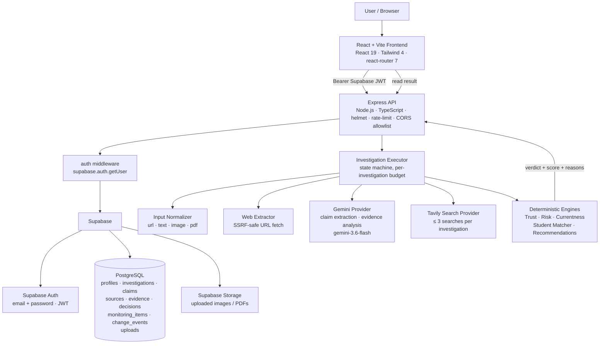

# Trustlify

**Evidence-driven AI investigation for opportunities and online claims.**

Trustlify helps students and researchers judge whether a scholarship, internship, fellowship, course or viral claim is genuinely trustworthy. Instead of returning a yes/no answer, it collects evidence from multiple sources, separates what a source actually says from what Trustlify infers, shows the provenance of every claim, and lands on a verdict with an explanation and a confidence band. It never claims to prove objective truth — it makes the reasoning auditable.

---

## ✨ Why Trustlify?

Students and opportunity-seekers run into the same problems every day:

- **Fake scholarships** and "opportunity" posts that only exist to collect fees or personal data.
- **Misleading internships / courses** that copy the wording of real programs.
- **Suspicious social posts** on WhatsApp, LinkedIn, Instagram that look official but link elsewhere.
- **Copied or outdated information** — a real program whose deadline closed a year ago, still being reshared.
- **Claims with no clear evidence** — big promises, no verifiable source.

Most AI answers just paraphrase the post and say "looks legit" or "looks scammy". Trustlify is built around a different principle:

1. **Investigate the claim**, not the vibe — decompose the input into individual, checkable claims.
2. **Collect evidence** — search the open web, fetch the strongest sources, quote them.
3. **Separate evidence from interpretation** — what a source *said* vs. what Trustlify *concluded* are always shown as different things.
4. **Show provenance** — every reason, quote and status is tied back to a specific source URL.
5. **Give a verdict + confidence** — one of four verdicts with a banded 0–100 score, plus a plain-language "why this verdict".
6. **Judge student relevance on top of the verdict** — when the signed-in user is a student, the result also covers whether *this specific person* is eligible, using fields we actually have and never guessing about the ones we don't.

Trustlify is designed so the model is never the judge. Gemini reads and structures; a deterministic Trust Engine decides.

---

## 🚀 Core Features

Everything below is implemented in this repository today. Features that are intentionally *not* implemented are called out honestly in their own section.

### AI Investigation

An investigation runs through an explicit, observable state machine (see [backend/src/investigation/executor.ts](backend/src/investigation/executor.ts)):

```
NORMALIZING → EXTRACTING_CONTENT → EXTRACTING_CLAIMS → SEARCHING
              → READING_SOURCES → ANALYZING_EVIDENCE
              → CALCULATING_TRUST → COMPLETE
```

Progress is surfaced to the UI via polling of `GET /api/investigations/:id` (no WebSocket — see [investigation/events.ts](backend/src/investigation/events.ts)) and shown on the Investigation Progress screen.

**Strict per-investigation cost contract** (from spec 40, enforced in code):

- Exactly **one** Gemini call for claim extraction.
- Exactly **one** Gemini call for evidence analysis.
- At most **3** Tavily search requests (`INVESTIGATION_MAX_SEARCHES`).
- At most **3** selected source page fetches (`INVESTIGATION_MAX_SOURCE_FETCHES`).
- **No** automatic retries. **No** fallback models. **No** recursive agents.

Failure is honest: a submitted URL that cannot be fetched fails the investigation (there is nothing to investigate). A search that returns nothing useful continues and can end in `UNVERIFIED` rather than fabricating a verdict. A single source-fetch failure keeps the source metadata and marks its content as unavailable.

### Evidence Analysis

The pipeline stores four related things about every investigation:

- **Claims** — atomic statements extracted from the input, each typed with one of the enum values from [types/investigation.ts](backend/src/types/investigation.ts) (`organization`, `opportunity`, `deadline`, `current_status`, `funding`, `fee`, `eligibility`, `application_url`, `data_request`, `location`, `contact`, `other`) and ranked `critical` / `important` / `supporting`.
- **Sources** — URLs discovered through Tavily search plus the URL the user submitted, normalized and conservatively classified by hostname as `government`, `academic`, `news`, `social`, `community` or `unknown` (see [investigation/sourceNormalizer.ts](backend/src/investigation/sourceNormalizer.ts); authority is only inferred from a defensible TLD signal, never from a title keyword).
- **Evidence** — the specific, quoted passages from each source, each labelled `supports` / `contradicts` / `neutral` / `insufficient` and tied back to the claim(s) they bear on.
- **Decisions** — the Trust Engine's verdict, trust score and reasons, persisted with the investigation.

Claim statuses (`supported`, `conflicting`, `contradicted`, `unsupported`, `insufficient`) are derived deterministically in [investigation/investigator.ts](backend/src/investigation/investigator.ts) from Gemini's structured JSON output. Every `supports` / `contradicts` excerpt is checked against the fetched source text; if the quotation cannot be found, the item is **downgraded to `insufficient`** (never silently trusted), and a `neutral`/`insufficient` item with a fabricated quotation is dropped entirely.

### Trust Engine (verdict + score, deterministic)

The verdict is produced by [backend/src/engines/trustEngine.ts](backend/src/engines/trustEngine.ts), not by an LLM. Same input always produces the same output.

Four verdicts, first match wins:

| Verdict | When it fires |
|---|---|
| `HIGH_RISK` | A strong risk pattern coexists with weak evidence — e.g. payment request + suspicious redirect, identity mismatch, or ≥3 risk signals with no authoritative support. |
| `UNVERIFIED` | A critical claim is unsupported or has insufficient evidence. Certainty cannot be forced. |
| `CAUTION` | Reliable sources materially conflict on a critical claim, or a risk signal flags a concern while the core is verified. |
| `VERIFIED` | Every critical claim is credibly supported, at least one by an authoritative source, with no material contradiction. |

Trust score is an additive 0–100 aid that is then **clamped into the verdict's band** so the number never contradicts the label: `VERIFIED 70–100 · CAUTION 40–69 · HIGH_RISK 0–39 · UNVERIFIED 5–49`.

Risk signals detected deterministically from evidence (see [riskEngine.ts](backend/src/engines/riskEngine.ts)): `payment_request`, `suspicious_redirect`, `weak_source_authority`, `identity_mismatch`, `unresolved_contradiction`, `missing_official_confirmation`.

Every displayed reason is generated from structured evidence or risk signals — never generic AI filler.

### Multiple Input Types

The `POST /api/investigations` endpoint accepts four input types (see [validators/investigation.ts](backend/src/validators/investigation.ts)):

| `inputType` | Payload | How it's used |
|---|---|---|
| `url` | `inputText` (validated URL) | Fetched via a SSRF-safe web extractor (see [utils/urls.ts](backend/src/utils/urls.ts) and [investigation/webExtractor.ts](backend/src/investigation/webExtractor.ts)); the fetched content becomes the primary material. |
| `text` | `inputText` (up to 10,000 chars) | Copied social posts, WhatsApp forwards, emails — pasted straight into the investigator. |
| `image` | `inputFilePath` after uploading through `POST /api/uploads` | Sent to Gemini's multimodal endpoint (`image/jpeg`, `image/png`, `image/webp`). 20 MB max. |
| `pdf` | `inputFilePath` after uploading through `POST /api/uploads` | Sent to Gemini's multimodal endpoint (`application/pdf`). 20 MB max. |

An optional `investigationQuestion` (≤ 500 chars) is stored separately as untrusted user context — it is *never* passed to the model as an instruction. A deterministic intent classifier reads it and steers which parts of the result are highlighted ("is this real?" vs. "am I eligible?" vs. "is it still open?").

### Student Intelligence

When the signed-in user's role is `student`, investigations are enriched with an eligibility and relevance comparison driven by their saved profile.

**Profile fields** the app actually stores (see [validators/profile.ts](backend/src/validators/profile.ts) and the `profiles` table):

- Display name, role (`student` / `general`)
- Education (free-text), **Education level** (`EDUCATION_LEVELS` enum), Field of study
- Country, Location, Age
- Skills (≤ 50, case-normalised), Interests (≤ 50)
- Experience, Portfolio URL
- Language, Timezone, Notification preferences

**Matcher dimensions** the student matcher (see [engines/studentMatcher.ts](backend/src/engines/studentMatcher.ts)) weighs against extracted requirement claims:

`education` · `field` · `country` · `skills` · `age` · `experience` · `language` · `gpa`

`deadline` is deliberately **excluded** from scoring and shown under a separate **TIMING** label — a closed application window is not held against the student's fit.

Each dimension resolves to one of four honest states, so an unverified thing never reads as a pass or a fail:

| State | Meaning | UI mark |
|---|---|---|
| `SATISFIED` | Source stated a requirement and the profile matches it. | ✓ |
| `NOT_SATISFIED` | Source stated a requirement and the profile does not match it. | ✗ |
| `NOT_STATED` | Source did not state a requirement for this dimension — not counted. | ? |
| `NOT_COMPARABLE` | Source stated something, but it could not be reliably compared. | ? |

The overall eligibility verdict is one of `ELIGIBLE`, `PARTIALLY_ELIGIBLE`, `NOT_ELIGIBLE`, `INSUFFICIENT_DATA`. When students see "not enough data", it is because the source genuinely didn't state the requirement — not a hidden failure.

All of this is pure derivation over data the investigation already stored. It uses **no network and no model call** (see [studentIntelligenceService.ts](backend/src/services/studentIntelligenceService.ts) — cost contract in its own header), so refreshing a result never re-bills anything.

### Currentness & Deadline Detection

Deterministic (no LLM): [engines/currentnessEngine.ts](backend/src/engines/currentnessEngine.ts).

- **Opportunity currency** — `CURRENT`, `EXPIRED`, `POSSIBLY_OUTDATED`, `UNKNOWN`, based on source publication dates and the state's own claims.
- **Deadline assessment** — `ACTIVE`, `EXPIRED`, `CONFLICTING`, `UNKNOWN`, from the extracted deadline claims. When two credible sources give different dates, Trustlify says so instead of picking one.

### Recommendations (Similar Opportunities)

`POST /api/investigations/:id/similar` — a **separate, user-triggered** endpoint (see [similarOpportunityService.ts](backend/src/services/similarOpportunityService.ts)).

- Runs **at most 2 Tavily searches**, never during an investigation. Reading a result page does not silently cost anything.
- A search hit is presented as a **lead**, not a verified opportunity. It only shows a verdict if Trustlify has already stored one for that exact URL — **trust is never inherited from a search ranking**.
- Match status on a lead is only shown when the candidate's own snippet states a comparable requirement the deterministic matcher can judge. Otherwise the card says "not enough data".
- Candidates whose snippet names students from a different country are dropped, not padded into the "better matches" row.

### Monitoring (honest scope)

The Monitoring page lets a signed-in user **save a completed investigation** and come back to it later. What it does today (see [services/monitoringService.ts](backend/src/services/monitoringService.ts)):

- Persist monitoring items per user in the `monitoring_items` table (Supabase).
- Show active / paused state via `PATCH`-style toggle (`toggleMonitoring`).
- Report **one specific kind of change** that the already-stored evidence proves on its own: the recorded application window was open when monitoring started and is not open now (`field: "deadline_state"`). This is assessed by the same deterministic deadline engine the result page uses, run at two clocks.

What it **does not** do — and the code is explicit about it:

- ⚠ **No background worker.**
- ⚠ **No scheduler.** Nothing runs on a timer.
- ⚠ **No proactive re-fetch of sources.** Monitoring never revisits the opportunity's page.
- ⚠ **No push / email notifications.**

The `MonitoringChange` type has a single field (`deadline_state`) for a reason: that is the only change this implementation can honestly claim without re-fetching anything. Automatic, scheduled source re-checking and user-facing notifications are **not implemented** and are reserved for a later phase.

### Authentication

Real Supabase authentication, not a mock:

- The frontend uses `@supabase/supabase-js` for email/password sign-up, sign-in, email confirmation, password reset and sign-out.
- Every protected API call carries `Authorization: Bearer <Supabase JWT>`.
- Backend middleware ([middleware/auth.ts](backend/src/middleware/auth.ts)) validates the JWT via `supabase.auth.getUser(token)`, then looks up the user's `role` (`student` / `general`) from the `profiles` table.
- Every service query is scoped by `user_id`, so a signed-in user only ever reads or mutates their own rows. A `requireOwnership` factory is also exported from the auth middleware as a reusable helper.
- Route-level protection in the SPA via a `ProtectedRoute` component in [src/App.tsx](src/App.tsx) — unauthenticated visitors are redirected to `/auth`.

### Two languages: English and Roman Urdu (deterministic, not machine-translated)

`src/i18n/resultTemplates.ts` renders Trustlify's *own* structured presentation — section headings, verdict labels, eligibility labels, computed summary sentences — in either English or Roman Urdu from a fixed template table. Same state always produces the same sentence. **No translation API is called.**

Explicit scope limit: raw evidence, quoted excerpts, source titles, URLs and the user's own question are **never** rewritten by the template layer — a template cannot restate them faithfully. When a sentence needs real prose it stays in its original language, and the card says so on-screen.

---

## 🧠 How It Works

```
       ┌───────────────────┐
       │       User        │
       └─────────┬─────────┘
                 ▼
    ┌────────────────────────────┐
    │  Input: URL / text /       │
    │  image / PDF  (+ optional  │
    │  question)                 │
    └────────────┬───────────────┘
                 ▼
    ┌────────────────────────────┐
    │  Investigation Pipeline    │
    │  (executor.ts state        │
    │   machine, per-user,       │
    │   persisted in Supabase)   │
    └────────────┬───────────────┘
                 ▼
    ┌────────────────────────────┐        ┌──────────────────┐
    │  Content extraction        │◄──────►│  Web fetch       │
    │  + claim extraction        │        │  (SSRF-safe)     │
    │  (Gemini, one call)        │        └──────────────────┘
    └────────────┬───────────────┘
                 ▼
    ┌────────────────────────────┐        ┌──────────────────┐
    │  Source discovery          │◄──────►│  Tavily search   │
    │  + top-3 fetch + quote     │        │  (≤ 3 calls)     │
    └────────────┬───────────────┘        └──────────────────┘
                 ▼
    ┌────────────────────────────┐
    │  Evidence analysis         │
    │  (Gemini, one call, JSON   │
    │   schema; every quoted     │
    │   excerpt verified against │
    │   the fetched source text) │
    └────────────┬───────────────┘
                 ▼
    ┌────────────────────────────┐
    │  Deterministic engines     │
    │  - Trust Engine (verdict)  │
    │  - Risk Engine             │
    │  - Currentness Engine      │
    └────────────┬───────────────┘
                 ▼
    ┌────────────────────────────┐
    │  Verdict + trust score +   │
    │  reasons + evidence +      │
    │  sources + next actions    │
    └────────────┬───────────────┘
                 ▼
    ┌────────────────────────────┐
    │  (If student)              │
    │  Eligibility + relevance   │
    │  + better-matches on ask   │
    └────────────────────────────┘
```

**Important honesty notes about this diagram:**

- Gemini is used to *understand* content, not to *decide* anything. The verdict is produced by the deterministic Trust Engine, in code, from the structured evidence Gemini returns.
- Trustlify reports the reading that the collected evidence supports. It does not claim to have proved that a thing is objectively true or false.
- Every stage's output is stored, so a user reloading the result page doesn't re-run anything and doesn't re-bill anything.

---

## 🏗️ Architecture



### Frontend

- **React 19** with functional components and hooks.
- **Vite 6** dev server + build.
- **TypeScript 5.8** (strict mode).
- **Tailwind CSS 4** (via `@tailwindcss/vite`).
- **react-router-dom 7** for routing.
- **framer-motion 12** for animation.
- **@xyflow/react 12** for the Evidence Graph view.
- **zod 3** for schema-driven validation shared with the backend's shapes.
- **@supabase/supabase-js 2** for auth and session storage on the client.
- Vitest + Testing Library for tests (`npm test`).

Route surface (see [src/App.tsx](src/App.tsx)): public `/` (Landing) and `/auth`; protected `/dashboard`, `/investigate`, `/student/onboarding`, `/investigation/:id`, `/investigation/:id/progress`, `/investigation/:id/evidence`, `/investigation/:id/match`, `/monitoring`, `/history`, `/settings`.

### Backend

- **Node.js** + **Express 4** + **TypeScript 5.8** (`tsx` for dev, `tsc` for build).
- Layered structure:

```
backend/src/
  server.ts                — Express wiring (helmet, CORS allowlist, body limits,
                             request-id, rate limiter, routers, error handler)
  config/
    env.ts                 — zod-validated environment (fails fast at boot)
    supabase.ts            — Supabase admin client
  middleware/
    auth.ts                — Supabase JWT validation, requireOwnership
    rateLimit.ts           — Global + per-feature rate limiters
    requestId.ts           — X-Request-ID propagation
    errorHandler.ts        — Centralized error envelope
  routes/                  — HTTP handlers: health, profile, investigations,
                             uploads, history, monitoring
  services/                — Domain services: investigation, monitoring,
                             profile, profileEvidence, similarOpportunity,
                             studentIntelligence, upload
  investigation/           — The pipeline itself: inputNormalizer, claimSelector,
                             searchPlanner, sourceNormalizer, webExtractor,
                             investigator, executor, questionIntent, events
  engines/                 — trustEngine, riskEngine, currentnessEngine,
                             studentMatcher, recommendationEngine (deterministic)
  ai/                      — AIProvider interface + GeminiProvider (REST),
                             optional ModelStudioProvider (legacy)
  search/                  — SearchProvider interface + TavilySearchProvider (REST)
  profile/                 — educationLevels canonical taxonomy used by the matcher
  utils/                   — logger, SSRF-safe URL helpers
  validators/              — zod schemas at every request boundary
  types/                   — shared TS types
  scripts/                 — smoke tests (Gemini, Tavily, mini investigation)
```

### Database & Auth

- **Supabase** — project-hosted Postgres + Auth + Storage.
- **Supabase Auth** issues the JWT the backend verifies via `supabase.auth.getUser()`.
- Migrations in [supabase/migrations](supabase/migrations):

  | File | Purpose |
  |---|---|
  | `001_initial_schema.sql` | Core tables + RLS policies. |
  | `002_search_metadata.sql` | Persisted search metadata on sources. |
  | `003_evidence_investigation.sql` | Evidence / claim / decision columns for the investigation. |
  | `004_student_intelligence.sql` | Fields used by the student-matching pass. |
  | `005_student_profile_structure.sql` | Structured student profile fields. |

  Core tables: `profiles`, `investigations`, `claims`, `sources`, `evidence`, `decisions`, `monitoring_items`, `change_events`, `uploads`. All row access from the API layer is scoped by `user_id` and protected by Supabase RLS.

### AI Provider

- **Google Gemini** via REST (`https://generativelanguage.googleapis.com/v1beta`).
- Default model: **`gemini-3.6-flash`** (overridable with `GEMINI_MODEL`; the older `gemini-2.5-flash` has been deprecated upstream).
- API key sent as `x-goog-api-key` header — **never** in a URL, **never** logged.
- Structured JSON output validated with zod before use; failure is treated as investigation failure, not as a reason to invent something.
- Prompt-injection defence: fetched page content, source titles and snippets are fenced as untrusted evidence. The model is instructed to treat them as data and ignore any instructions embedded inside them.

### Web Research Provider

- **Tavily Search API** via REST (`https://api.tavily.com`).
- API key sent as `Authorization: Bearer` header.
- Returned titles / snippets are stored as **strings only** — never evaluated, never fetched during the search step.
- **No retries, no fallback providers.** One network call per planned query.

### Communication

- The frontend talks to the backend over a strict CORS allowlist (comma-separated absolute origins in `FRONTEND_ORIGIN`). `*` is never allowed.
- Every response uses a uniform envelope: `{ success, data | error, requestId }`.
- Rate limiting is applied globally on `/api`, plus a stricter bucket for investigations and uploads.

---

## 📦 Getting Started

### Prerequisites

- **Node.js 20+** (the backend uses `--env-file=` and other modern Node features).
- **npm** (both packages use plain `npm install`).
- A **Supabase** project (free tier is fine for local dev).
- A **Google Gemini API key** (for claim extraction and evidence analysis).
- A **Tavily API key** (for web search).

### 1. Clone and install

```bash
git clone <your-fork-url> Trustlify
cd Trustlify

# Frontend deps
npm install

# Backend deps
cd backend
npm install
cd ..
```

### 2. Configure environment

Copy the example env files and fill in real values. **Never commit the resulting `.env` files** — `.gitignore` already excludes them.

Frontend (`.env` at the repo root):

```ini
VITE_SUPABASE_URL=https://your-project.supabase.co
VITE_SUPABASE_PUBLISHABLE_KEY=your-anon-or-publishable-key
VITE_API_BASE_URL=http://localhost:3000
```

Backend (`backend/.env`):

```ini
NODE_ENV=development
PORT=3000
FRONTEND_ORIGIN=http://localhost:5173,http://127.0.0.1:5173

SUPABASE_URL=https://your-project.supabase.co
SUPABASE_PUBLISHABLE_KEY=your-anon-or-publishable-key
SUPABASE_SECRET_KEY=your-service-role-key

GEMINI_API_KEY=your-gemini-key
GEMINI_MODEL=gemini-3.6-flash

TAVILY_API_KEY=your-tavily-key
```

Optional tuning knobs (safe defaults already set — see [backend/src/config/env.ts](backend/src/config/env.ts)):

| Variable | Default | Meaning |
|---|---:|---|
| `URL_FETCH_TIMEOUT_MS` | `10000` | Per-page fetch timeout. |
| `URL_FETCH_MAX_BYTES` | `2000000` | Max bytes accepted from a page. |
| `URL_MAX_CONTENT_CHARS` | `20000` | Cap on extracted text sent to the model. |
| `INVESTIGATION_MAX_SEARCHES` | `3` (hard max 3) | Tavily calls per investigation. |
| `INVESTIGATION_MAX_SOURCE_FETCHES` | `3` (hard max 3) | Pages fetched per investigation. |

### 3. Apply database migrations

Run the SQL files in [supabase/migrations](supabase/migrations) against your Supabase project, in order (`001` → `005`). Either paste them into the Supabase SQL editor or use the Supabase CLI:

```bash
supabase db push   # if you use the CLI and have linked the project
```

### 4. Run the two processes side-by-side

Terminal A — backend (hot reload via `tsx watch`):

```bash
cd backend
npm run dev
```

Terminal B — frontend:

```bash
npm run dev
```

Open `http://localhost:5173`, create an account, complete onboarding, and start an investigation.

### 5. Optional: provider smoke tests

Cheap checks that your keys actually work before running a full investigation:

```bash
cd backend
npm run smoke:gemini        # 1 Gemini request
npm run smoke:tavily        # 1 Tavily request
npm run smoke:investigation # a tiny end-to-end run
```

---

## 🧪 Scripts

### Frontend (`package.json`)

| Command | What it does |
|---|---|
| `npm run dev` | Vite dev server on `:5173` (strict port; fails rather than silently bumping). |
| `npm run build` | `tsc -b && vite build` → type-checks then emits `dist/`. |
| `npm run preview` | Locally serve the built `dist/`. |
| `npm test` | Run frontend Vitest suite once. |

### Backend (`backend/package.json`)

| Command | What it does |
|---|---|
| `npm run dev` | `tsx watch --env-file=.env src/server.ts` on `:3000`. |
| `npm run build` | Compile TS → `backend/dist/`. |
| `npm start` | Run the compiled server (`node dist/server.js`). |
| `npm test` | Run backend Vitest suite once. |
| `npm run test:watch` | Vitest watch mode. |
| `npm run lint` | `tsc --noEmit` type-check without emitting. |
| `npm run smoke:gemini` | One-shot Gemini connectivity smoke test. |
| `npm run smoke:tavily` | One-shot Tavily connectivity smoke test. |
| `npm run smoke:investigation` | Small end-to-end investigation smoke test. |

---

## 🌐 API Reference (summary)

All endpoints below are on the backend. `GET /api/health` is public; everything else requires `Authorization: Bearer <Supabase JWT>`.

### Health

| Method | Path | Purpose |
|---|---|---|
| `GET` | `/api/health` | Liveness check. |

### Profile

| Method | Path | Purpose |
|---|---|---|
| `GET`  | `/api/profile` | Read current user's profile. |
| `POST` | `/api/profile` | Create / upsert the profile. |
| `PATCH`| `/api/profile` | Partial update. |

### Investigations

| Method | Path | Purpose |
|---|---|---|
| `POST` | `/api/investigations` | Create an investigation. Body: `{ inputType: "url"\|"text"\|"image"\|"pdf", inputText?, inputFilePath?, investigationQuestion? }`. |
| `POST` | `/api/investigations/:id/start` | Kick off the pipeline (returns `202 Accepted` immediately). |
| `GET`  | `/api/investigations/:id` | Read current state, claims, sources, evidence, decision, student match. |
| `POST` | `/api/investigations/:id/recheck` | Re-run the currentness / deadline assessment without re-billing providers. |
| `POST` | `/api/investigations/:id/monitor` | Save the investigation as a monitoring item. |
| `POST` | `/api/investigations/:id/similar` | Ask for better-matched opportunities. **User-triggered only**, at most 2 searches. |

### Uploads

| Method | Path | Purpose |
|---|---|---|
| `POST` | `/api/uploads` | Multipart upload (`file`, 20 MB, allowed: `image/jpeg`, `image/png`, `image/webp`, `application/pdf`). |
| `POST` | `/api/uploads/metadata` | Register metadata-only for an already-stored upload. |

### History & Monitoring

| Method | Path | Purpose |
|---|---|---|
| `GET`   | `/api/history` | List the signed-in user's investigations. |
| `GET`   | `/api/monitoring` | List monitoring items with their persisted-evidence changes. |
| `PATCH` | `/api/monitoring/:id` | Toggle a monitoring item active / inactive. |

Every response follows the envelope `{ success, data | error, requestId }`. Errors include a stable `code` field — for example `UNAUTHORIZED`, `FORBIDDEN`, `NOT_FOUND`, `VALIDATION_ERROR`, `INVALID_JSON`, `INVALID_STATE`, `INVALID_MIME`, `FILE_TOO_LARGE`, `RATE_LIMIT_EXCEEDED`, `MONITORING_START_FAILED`, `UPLOAD_FAILED`, `INTERNAL_ERROR`.

---

## 🔐 Security Posture

Concrete, implemented controls:

- **Helmet** security headers on every response.
- **Strict CORS allowlist** parsed from `FRONTEND_ORIGIN`; wildcard never permitted; validated as absolute URLs at boot.
- **Body size limits** (`express.json({ limit: "1mb" })`).
- **Rate limiting** on `/api` globally, plus stricter per-bucket limiters for investigations and uploads (`express-rate-limit`).
- **Request ID** middleware for correlating logs, exposed as `X-Request-ID` on responses.
- **Supabase JWT validation** on every protected route via `supabase.auth.getUser()`.
- **Ownership enforcement** — every service query filters by `user_id`, so users can only read or mutate their own rows. Supabase **RLS** policies (see migration `001`) are a second line of defense at the database layer.
- **SSRF-safe URL handling** for user-supplied and search-returned URLs ([utils/urls.ts](backend/src/utils/urls.ts)) — private / loopback / metadata ranges are rejected before any fetch.
- **Untrusted-content fence**: fetched web pages, Tavily snippets, uploaded filenames and user questions are treated as inert data. They are never eval'd, never allowed to alter pipeline behavior, and are explicitly marked as evidence to Gemini.
- **API keys** are held server-side only, sent in headers (never in URLs), and scrubbed from error messages before surfacing.

---

## 🗺️ What's Deliberately Not Implemented

Trustlify errs toward saying so explicitly rather than implying more than it can back up:

- ❌ **No background worker / scheduler / cron.** The stack is request-driven Express only.
- ❌ **No automated, scheduled source re-checking.** Monitoring reports only the deadline-window transition it can derive from already-stored evidence.
- ❌ **No email / push notifications.**
- ❌ **No Redis or external queue.** The in-memory job store used in Phase 1 has since been replaced by Supabase persistence for the pipeline state.
- ❌ **No LLM-decided verdicts.** Gemini never produces the verdict or the score; those are computed by the deterministic Trust Engine.
- ❌ **No automatic retries or fallback models.** If Gemini or Tavily fails, the failure is honest and reported.
- ❌ **No machine translation.** Roman Urdu output is a fixed template table, not a translation service.

---

## 📁 Repository Layout

```
Trustlify/
├── src/                         # React + Vite frontend
│   ├── pages/                   # Landing, Auth, Onboarding, Dashboard,
│   │                            #   Investigate, InvestigationProgress,
│   │                            #   InvestigationResult, EvidenceGraph,
│   │                            #   StudentMatch, Monitoring, History, Settings
│   ├── components/              # Shared UI, AppShell, Button, Evidence Graph,
│   │   └── CinematicEvidenceHero/  # Landing-page scroll choreography
│   ├── hooks/                   # useAuth, useInvestigation, useUserProfile,
│   │                            #   useScroll, useSpringSmoothed
│   ├── i18n/                    # resultTemplates.ts (English / Roman Urdu)
│   ├── data/                    # Static catalogues (e.g. skillCatalogue.ts)
│   ├── lib/                     # apiFetch and helpers
│   ├── mock/                    # Local demo fixtures (not used in prod flows)
│   ├── types/                   # Frontend shared types
│   ├── assets/posts/            # 5 product hero images (imported by code)
│   └── __tests__/               # Vitest suites + setup
│
├── backend/                     # Express API
│   └── src/                     # (see Architecture section above)
│
├── supabase/migrations/         # Ordered SQL migrations (001 → 005)
├── docs/                        # Design specs, phase maps, competitive context
├── designs/                     # Visual design references (Figma Make exports,
│                                #   parallax reference pack, WhatsApp stills)
├── .env / .env.example          # Frontend env (never committed)
├── vite.config.ts               # React + Tailwind plugins, @/ alias, strict port
├── vitest.config.ts             # Frontend test config (jsdom)
├── tsconfig.json                # Frontend TS config
├── package.json                 # Frontend scripts + deps
└── README.md                    # This file
```

---

## 🧭 Reading the Result Page

The InvestigationResult page is the product surface, and its sections mirror what the pipeline can honestly back:

| Section | What it shows |
|---|---|
| **You asked** | The stored investigation question verbatim, plus the deterministic intent that was recognised. |
| **Verdict + trust score** | The Trust Engine's decision (never Gemini's), with a banded 0–100 score and reasons generated from structured evidence. |
| **Currentness** | Whether the opportunity is current, expired or possibly outdated, and the deadline state derived from stored claims. |
| **What we could and couldn't assess** | The student-matcher dimension table with the four honest states (`SATISFIED`, `NOT_SATISFIED`, `NOT_STATED`, `NOT_COMPARABLE`). |
| **Extracted claims** | The atomic claims Trustlify pulled from the input, each typed and ranked. |
| **Verified evidence** | Quoted passages from each source, each tied to the claim(s) they bear on. |
| **Discovered sources** | The URLs Trustlify considered, with authority classification and per-source status. |
| **Recommended source** | The single best source to read next, chosen deterministically. |
| **Recommended action** | The next step, phrased from a template the current state can honestly support. |
| **Better matches** | Only present when the student has explicitly asked for them. Cards marked as leads unless Trustlify has already stored a verdict for that exact URL. |

Verdicts are evidence-based readings, **not legal, financial or admission advice**.

---

## 📚 Deeper Docs

- [docs/TRUSTLIFY_BUILD_SYSTEM_V1.md](docs/TRUSTLIFY_BUILD_SYSTEM_V1.md) — product spec and phase plan.
- [docs/BACKEND_PHASE_MAP.md](docs/BACKEND_PHASE_MAP.md) — backend phase mapping.
- [docs/08_BACKEND_AI_HANDOFF_V2.md](docs/08_BACKEND_AI_HANDOFF_V2.md) — AI provider handoff contract.
- [docs/12_RESEARCH_SOURCES_AND_COMPETITIVE_CONTEXT.md](docs/12_RESEARCH_SOURCES_AND_COMPETITIVE_CONTEXT.md) — sources and competitive context.
- [docs/FINAL_PROBLEM_EVIDENCE_IMPACT_PACK_V3.md](docs/FINAL_PROBLEM_EVIDENCE_IMPACT_PACK_V3.md) — the problem evidence this build responds to.
- [docs/Trustlify_Final_Visual_Design_System_V1.md](docs/Trustlify_Final_Visual_Design_System_V1.md) — the visual system.
- [backend/README.md](backend/README.md) — backend-only run instructions.

---

## License

Private / to be defined. No open-source license has been declared for this repository yet.
